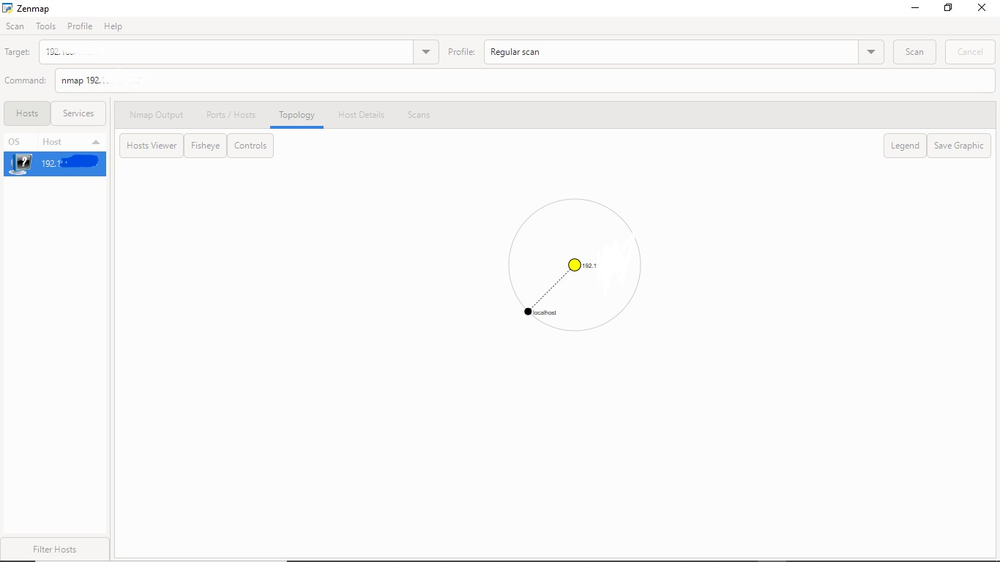

# penetration-testing-report
Penetration testing report - Footprinting and Scanning Phase (NetworkWalks)

**W2-PM | Cyber Security | NetworkWalks**

| Field | Details |
|---|---|
| **Pentester Name** | Ibrahim Muhammed Bello |
| **Program/Batch** | BO83-Networkwalks |
| **Date** | 20 September, 2026 |
| **Modules Completed** | W2-PM1 (Multiple Kali Tools), W2-PM5 (Zenmap Scanning) |
| **Client/Target** | 1. Networkwalks 2. My own local LAN Network |
| **Permission Secured from Client?** | Yes |
| **Phases Covered** | Phase 1: Reconnaissance & Footprinting Phase 2: Scanning & Network Discovery |

## 1. Liability Disclaimer

This assessment is strictly carried out within the scope authorized by the client.

## 2. Introduction

This report covers the footprinting of the NetworkWalks domain, using multiple Kali Linux tools, and also the scanning results of my local IP address using Zenmap. This report has two steps which show how attackers move from gathering information from public sources to mapping live hosts on a network. The footprinting was done using Linux, while the scanning was done using Zenmap installed on a Windows device.

## 3. Tools Used

| Tools | Purpose |
|---|---|
| Kali Linux & Windows | Operating systems used for reconnaissance activities. |
| whois | Find domain registration details (name, dates, servers). |
| whatweb | Fingerprint web technologies (server, CMS, plugins, IP). |
| nslookup | Resolve the domain name to its IP address using DNS. |
| curl -I | Read the HTTP response headers of the website. |
| wafw00f | Detect whether a Web Application Firewall protects the site. |
| dnsrecon -d | Enumerate all DNS records (NS, MX, SPF, TXT, and SRV). |
| Zenmap (Nmap GUI) | Scan the local subnet to find live hosts, IPs, and MAC addresses. |
| Windows cmd | Identification of local IP and MAC address. |

## 4. Footprinting

### 4.1 Activities Performed

I used the following Linux tools to perform reconnaissance on the NetworkWalks domain: whois, whatweb, nslookup, curl -I, wafw00f, and dnsrecon -d. All of these tools were used to collect different information.

Firstly, I used whois to obtain publicly available domain registration information and identify the domain’s name servers. The results provided information about the domain registration and hosting infrastructure.

Secondly, I used whatweb to identify the technologies used by the website. After that, I proceeded to the third step.

Thirdly, I used nslookup to resolve the domain name to its IP address. After that, I proceeded to the next step.

Fourthly, I used curl -I to inspect the HTTP response headers. This provided additional information about the web application and exposed the WordPress REST API endpoint /wp-json/.

Fifth, I used wafw00f to determine whether a Web Application Firewall was protecting the website, and the result identified Mod Security (Spider Labs).

Finally, I used dnsrecon to enumerate DNS records. The results provided information relating to name servers, mail servers, SPF/TXT records, service records, and DNS software information.

### 4.2 Network Scanning with Zenmap

For the second phase, I used Zenmap to scan my local network. The practical required me to identify my local IP address and subnet, discover live hosts, identify their IP and MAC addresses, and generate a network topology.

I first used the Windows `ipconfig` command to identify my local IP address and LAN. I then entered the subnet into Zenmap and selected **Ping Scan** to identify active hosts.

After completing the scan, I opened the **Topology** section in Zenmap, enabled the legend, and saved the network topology in PDF format as required by the practical task.

## 5. Risk Analysis / Impact

Based on the information collected during the footprinting and network scanning activities, I identified the following potential risks.

| S/N | Risk/Finding | Evidence/Observation | Potential Impact | Risk Level |
|---|---|---|---|---|
| 1 | Web technology information exposed | whatweb identified WordPress and WP Download Manager | Attackers use exposed technology/version information to identify software requiring further security review | 🟠 Medium |
| 2 | Server IP address identifiable | nslookup resolved the domain to its IP address | Knowledge of the server IP may assist further reconnaissance or direct targeting | 🟡 Low |
| 3 | HTTP technical information exposed | curl -I returned HTTP response headers and exposed /wp-json/ | May assist technology fingerprinting and further enumeration | 🟡 Low |
| 4 | WAF technology identifiable | wafw00f identified Mod Security (Spider Labs) | Knowledge of the WAF in use may help attackers craft bypass techniques | 🟡 Low |
| 5 | DNS infrastructure information exposed | dnsrecon enumerated NS, MX, SPF/TXT, and SRV records | DNS information can help build a broader infrastructure profile | 🟠 Medium |
| 6 | Multiple live hosts visible on local network | Zenmap identified four live hosts on the local network | Unauthorized devices may potentially be present on the network | 🟠 Medium |

**Risk level key:** 🔴 Critical &nbsp;&nbsp; 🟠 Medium &nbsp;&nbsp; 🟡 Low

The risks above are observations from the footprinting and scanning exercises, not confirmed vulnerabilities. The practical exercises primarily involved information gathering and host discovery. No exploitation or vulnerability validation was performed. Further authorized security testing would be required to confirm any actual vulnerability.

## 6. Recommendations

Based on the observations from these activities, I recommend the following security improvements:

1. **Review publicly exposed technology information** — Organizations should regularly review what information about their web technologies, CMS, and plugins is publicly visible.
2. **Keep software updated** — CMS platforms, plugins, and other web technologies should be regularly updated and reviewed against current security advisories.
3. **Review HTTP headers** — HTTP response headers should be reviewed to determine whether unnecessary technical information is being exposed.
4. **Review DNS records regularly** — DNS records should be checked periodically to ensure that only required information and services are publicly exposed.
5. **Properly configure and monitor the WAF** — Keep the WAF (Mod Security) enabled and tuned, since it already blocks naive attacks.
6. **Perform regular internal network discovery** — Organizations should periodically scan their own networks to identify active devices.
7. **Investigate unknown devices** — Any unexpected device discovered during network scanning should be investigated and verified.
8. **Maintain network documentation** — Network topology and device information should be documented and updated regularly.
9. **Perform security testing with authorization** — Reconnaissance and scanning should only be performed against systems and networks where appropriate authorization has been provided.

## 7. Conclusion

During Week 2 of my Cybersecurity & Ethical Hacking internship, I completed practical activities covering footprinting, reconnaissance, and network scanning.

In the footprinting activity, I used six Kali Linux tools to collect information about the target domain. I learned how WHOIS can provide domain information, WhatWeb can identify web technologies, nslookup can resolve domain names, curl can inspect HTTP headers, wafw00f can identify a WAF, and dnsrecon can provide additional DNS information.

In the network scanning activity, I used Zenmap to identify my local network configuration and discover active hosts. I also collected IP and MAC address information and created a network topology.

I learned from the exercise that information gathering is an important part of cybersecurity. Even before attempting to exploit a system, a security professional can learn a significant amount about an environment by carefully analyzing publicly available information and network responses.

I also learned that technical findings should be documented clearly. A good cybersecurity report should explain what was performed, what was discovered, what the observation means, what risk it may create, and what can be done to reduce that risk.

Finally, I learned that reconnaissance and scanning must always be performed within an authorized scope. These activities were completed as part of the assigned educational cybersecurity lab.

## Author

**mumbelsec**
Cybersecurity Professional
[LinkedIn](your-linkedin-url-here)
