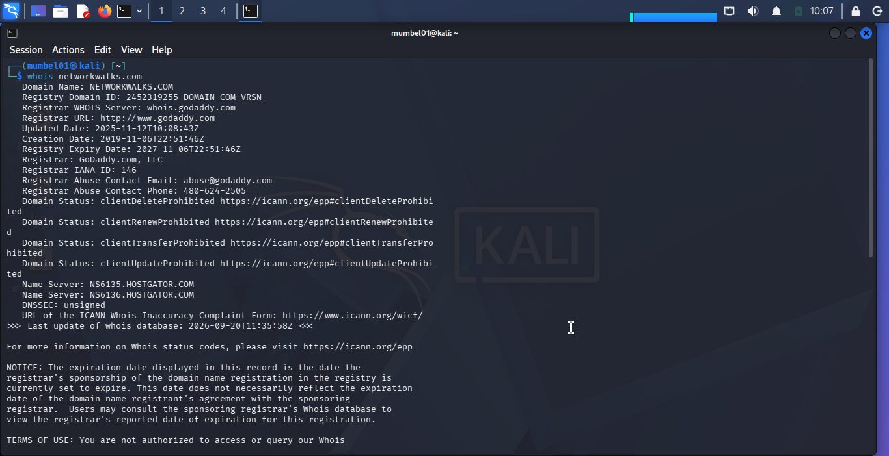
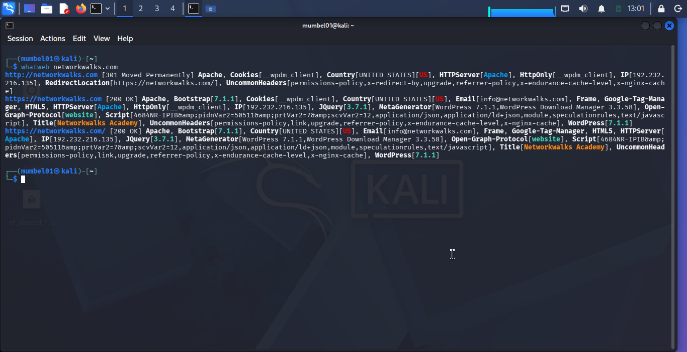
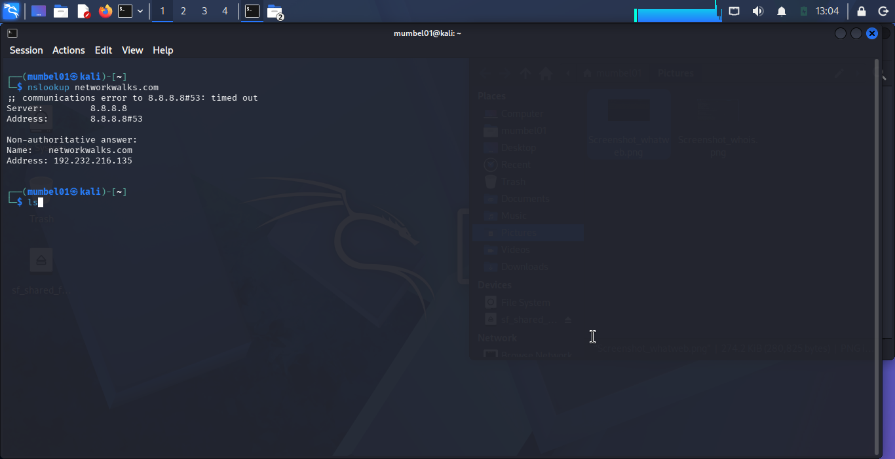
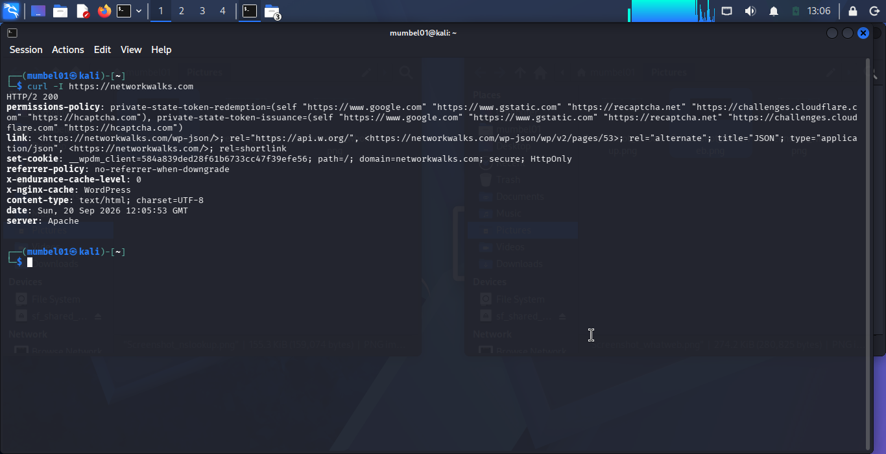
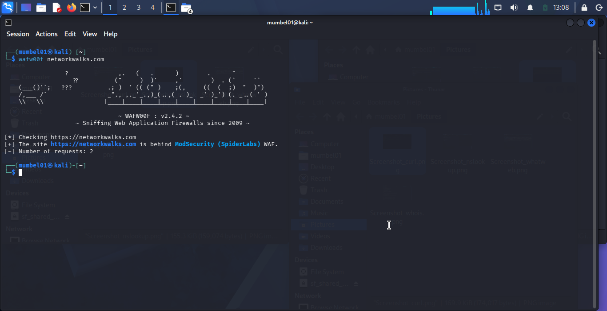
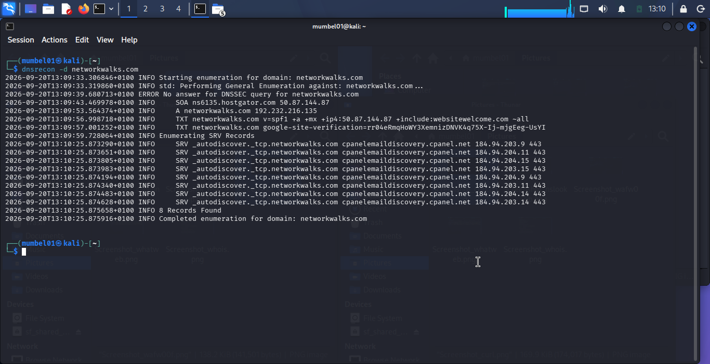

# penetration-testing-report
Penetration testing report - Footprinting and Scanning Phase (NetworkWalks)

**W2-PM | Cyber Security | NetworkWalks**

| Field | Details |
|---|---|
| **Pentester Name** | Ibrahim Muhammed Bello |
| **Program/Batch** | BO83-Networkwalks |
| **Date** | 20 September, 2026 |
| **Modules Completed** | W2-PM1 (Multiple Kali Tools), W2-PM5 (Zenmap Scanning) |
| **Client/Target** | 1. Networkwalks 2. My own local LAN Network |
| **Permission Secured from Client?** | Yes |
| **Phases Covered** | Phase 1: Reconnaissance & Footprinting Phase 2: Scanning & Network Discovery |

## 1. Liability Disclaimer

This assessment is strictly carried out within the scope authorized by the client.

## 2. Introduction

This report covers the footprinting of the NetworkWalks domain, using multiple Kali Linux tools, and also the scanning results of my local IP address using Zenmap. This report has two steps which show how attackers move from gathering information from public sources to mapping live hosts on a network. The footprinting was done using Linux, while the scanning was done using Zenmap installed on a Windows device.

## 3. Tools Used

| Tools | Purpose |
|---|---|
| Kali Linux & Windows | Operating systems used for reconnaissance activities. |
| whois | Find domain registration details (name, dates, servers). |
| whatweb | Fingerprint web technologies (server, CMS, plugins, IP). |
| nslookup | Resolve the domain name to its IP address using DNS. |
| curl -I | Read the HTTP response headers of the website. |
| wafw00f | Detect whether a Web Application Firewall protects the site. |
| dnsrecon -d | Enumerate all DNS records (NS, MX, SPF, TXT, and SRV). |
| Zenmap (Nmap GUI) | Scan the local subnet to find live hosts, IPs, and MAC addresses. |
| Windows cmd | Identification of local IP and MAC address. |

## 4. Footprinting

### 4.1 Activities Performed

I used the following Linux tools to perform reconnaissance on the NetworkWalks domain: whois, whatweb, nslookup, curl -I, wafw00f, and dnsrecon -d. All of these tools were used to collect different information.

Firstly, I used whois to obtain publicly available domain registration information and identify the domain’s name servers. The results provided information about the domain registration and hosting infrastructure.

Secondly, I used whatweb to identify the technologies used by the website. After that, I proceeded to the third step.

Thirdly, I used nslookup to resolve the domain name to its IP address. After that, I proceeded to the next step.

Fourthly, I used curl -I to inspect the HTTP response headers. This provided additional information about the web application and exposed the WordPress REST API endpoint /wp-json/.

Fifth, I used wafw00f to determine whether a Web Application Firewall was protecting the website, and the result identified Mod Security (Spider Labs).

Finally, I used dnsrecon to enumerate DNS records. The results provided information relating to name servers, mail servers, SPF/TXT records, service records, and DNS software information.

### 4.2 Network Scanning with Zenmap

For the second phase, I used Zenmap to scan my local network. The practical required me to identify my local IP address and subnet, discover live hosts, identify their IP and MAC addresses, and generate a network topology.

I first used the Windows `ipconfig` command to identify my local IP address and LAN. I then entered the subnet into Zenmap and selected **Ping Scan** to identify active hosts.

After completing the scan, I opened the **Topology** section in Zenmap, enabled the legend, and saved the network topology in PDF format as required by the practical task.
